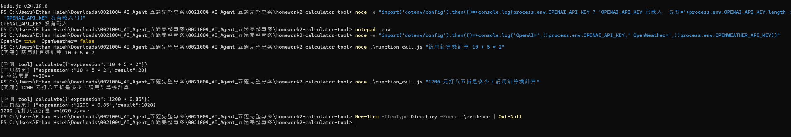

# 作業 2：計算機工具

謝宜村｜工號 0021004｜Group 5

**目前狀態：HW2 已完成真實 Function Calling 驗收；AI 已實際呼叫 calculate 工具，計算結果 20 與 1020 均正確，並已附終端截圖證據。**

## 原始基底

Repository：`kaochenlong/ai-agent-js-v8`  
指定分支：`2.5-tool-calling-current-time`  
鎖定 commit：`5ca9ffc72ad4fe0a3583164d5788550047c30f8e`

本資料夾已整理為可獨立安裝與執行的繳交專案；`BASELINE.md` 記錄指定 branch、commit 與本題修改。

## 選擇與實作

新增 tools/calculate.js、tools/arithmetic.js，使用原本 defineTool 與 Zod；在原 tools/index.js 增加 export。function_call.js 保留課程流程，改成可由命令列提供問題並顯示真實工具結果。

## 安裝及環境

在此題專案根目錄執行 `npm install`，複製原 `.env.example` 為 `.env`，只在公司核准的本機環境填入仍有效的授權金鑰。不要貼進程式、README、截圖或版本控制。課程原模型名稱保留；帳號無存取權、金鑰失效、額度或連線有問題時，記錄錯誤並停止，不持續重跑。

## 驗收方式

在本題專案根目錄執行，每次只跑一題：

```powershell
node function_call.js "請用計算機計算 10 + 5 * 2"
node function_call.js "請用計算機計算 (10 + 5) * 2"
node function_call.js "1200 元打八五折是多少？請用計算機算"
```

驗收預期分別為 20、30、1020；必須看到真正的 `[呼叫 tool] calculate(...)`、`[工具結果]` 與模型回答。這些預期值不是 API 執行紀錄。截取真實終端畫面（勿包含金鑰），存成 `evidence/hw2-function-calling.png`，再在本 README 插入圖片。自行解析算式，不使用 eval。新增測試檔可用 `node --test tests/homework-calculator.test.js` 執行。

## 實際 Function Calling 驗收結果

### 測試 1

**問題**

請用計算機計算 `10 + 5 * 2`

**實際工具呼叫**

    [呼叫 tool] calculate({"expression":"10 + 5 * 2"})
    [工具結果] {"expression":"10 + 5 * 2","result":20}

**結果**

20

---

### 測試 2

**問題**

1200 元打八五折是多少？請用計算機計算

**實際工具呼叫**

    [呼叫 tool] calculate({"expression":"1200 * 0.85"})
    [工具結果] {"expression":"1200 * 0.85","result":1020}

**結果**

1020

---

### 截圖證據



### 驗收結論

- `calculate` 工具有被 AI 實際呼叫
- 工具參數正確
- `10 + 5 * 2 = 20`
- `1200 × 0.85 = 1020`
- 計算結果正確
