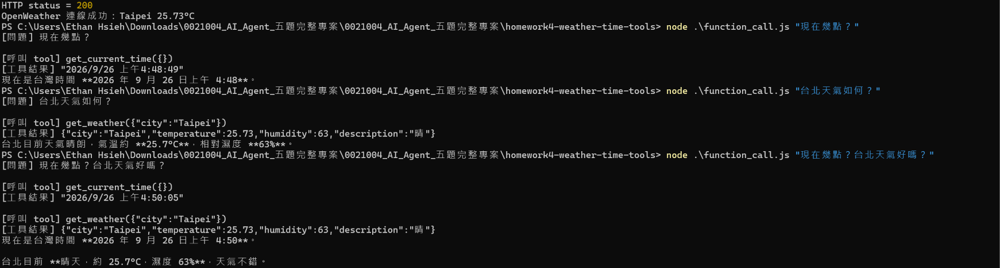

# 作業 4：時間與天氣工具

謝宜村｜工號 0021004｜Group 5

**目前狀態：HW4 已完成真實外部服務驗收；時間工具、天氣工具與時間＋天氣雙工具整合皆已通過，並已附實際截圖證據。**

## 原始基底

Repository：`kaochenlong/ai-agent-js-v8`  
指定分支：`2.5-tool-calling-current-time`  
鎖定 commit：`5ca9ffc72ad4fe0a3583164d5788550047c30f8e`

本資料夾已整理為可獨立安裝與執行的繳交專案；`BASELINE.md` 記錄指定 branch、commit 與本題修改。

## 選擇與實作

只修改 function_call.js 的系統指令、問題輸入與結果顯示。保留原 weather/current_time/youbike 工具及八輪上限。

## 安裝及環境

在此題專案根目錄執行 `npm install`，複製原 `.env.example` 為 `.env`，只在公司核准的本機環境填入仍有效的授權金鑰。不要貼進程式、README、截圖或版本控制。課程原模型名稱保留；帳號無存取權、金鑰失效、額度或連線有問題時，記錄錯誤並停止，不持續重跑。

## 驗收方式

設定 OPENAI_API_KEY 與原天氣服務的 OPENWEATHER_API_KEY。每次只執行一次：

```powershell
node function_call.js "現在幾點？"
node function_call.js "台北天氣如何？"
node function_call.js "現在幾點？台北天氣好嗎？"
```

逐項核對模型實際選擇：第一題時間工具、第二題天氣工具、第三題兩個工具皆有且回答整合結果。不要強制 tool_choice 或手動代印成功標籤。工具失敗應記錄失敗；不可用假天氣代替。把三題實際終端輸出貼在下方。

## 實際驗收結果

### 測試 1：只問時間

問題：

`現在幾點？`

實際工具呼叫：

    [呼叫 tool] get_current_time({})

判定：AI 正確選擇時間工具。

---

### 測試 2：只問天氣

問題：

`台北天氣如何？`

實際工具呼叫：

    [呼叫 tool] get_weather({"city":"Taipei"})

工具結果：

- city: Taipei
- temperature: 25.73°C
- humidity: 63%
- description: 晴

判定：AI 正確選擇天氣工具。

---

### 測試 3：同時詢問時間與天氣

問題：

`現在幾點？台北天氣好嗎？`

同一輪實際呼叫：

    [呼叫 tool] get_current_time({})
    [呼叫 tool] get_weather({"city":"Taipei"})

AI 成功將台灣時間與台北即時天氣整合成同一個回答。

### 截圖證據



## 驗收結論

- 時間問題會呼叫 `get_current_time`
- 天氣問題會呼叫 `get_weather`
- 同時詢問兩項資訊時會呼叫兩個工具
- AI 能整合兩個工具的真實結果後回答
- HW4 驗收完成
