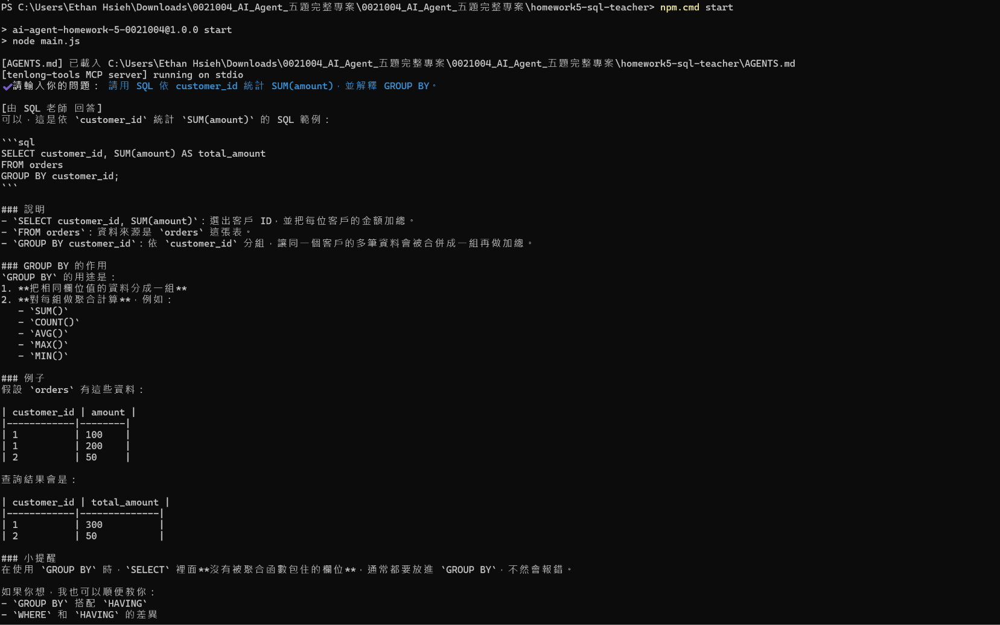
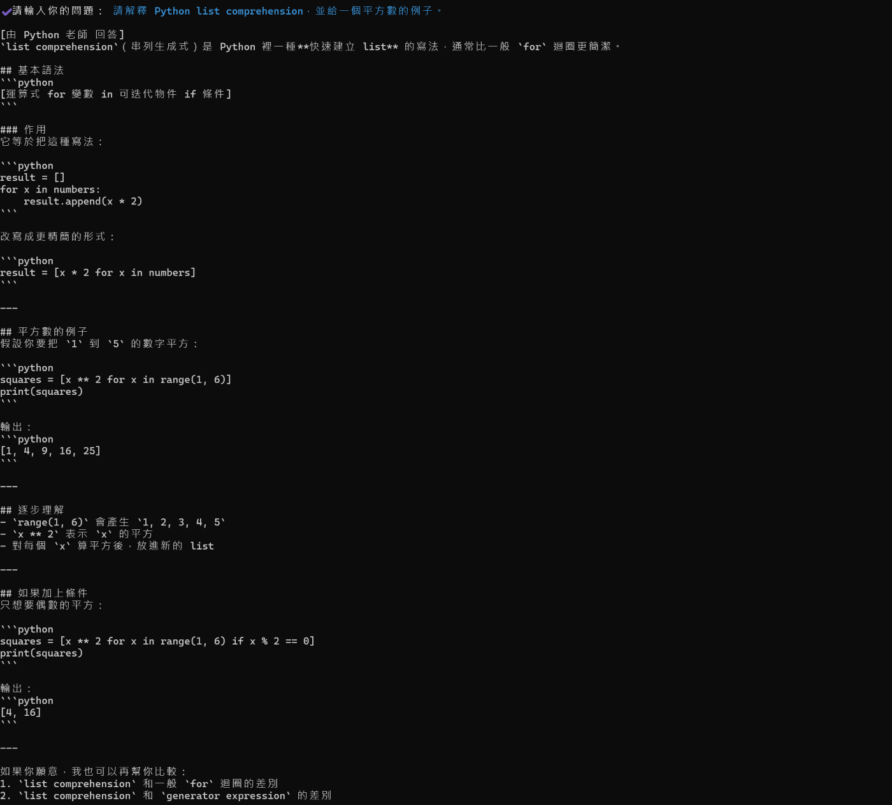
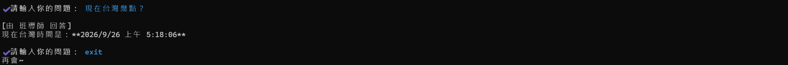

# 作業 5：新增 SQL 老師

謝宜村｜工號 0021004｜Group 5

**目前狀態：HW5 已完成真實 Agent Handoff 驗收。SQL 問題成功轉交 SQL 老師，Python 問題維持由 Python 老師處理，時間工具問題由班導師自行處理；AGENTS.md routing 規則已確認生效。**

## 原始基底

Repository：`kaochenlong/ai-agent-js-v8`  
指定分支：`5.1-agents-md`  
鎖定 commit：`a2f4bc28e25089c90e9eecccb1b511d6ce9c8b5b`

本資料夾已整理為可獨立安裝與執行的繳交專案；`BASELINE.md` 記錄指定 branch、commit 與本題修改。

## 選擇與實作

只在原 main.js 新增 SQL Agent 與 handoffs 成員，並修改此專案根目錄唯一生效的 AGENTS.md。原三位老師、Python 書籍 RAG、YouBike、Netflix、Tenlong MCP 都保留。

## 安裝及環境

在此題專案根目錄執行 `npm install`，複製原 `.env.example` 為 `.env`，只在公司核准的本機環境填入仍有效的授權金鑰。不要貼進程式、README、截圖或版本控制。課程原模型名稱保留；帳號無存取權、金鑰失效、額度或連線有問題時，記錄錯誤並停止，不持續重跑。

## 驗收方式

務必先 `cd` 到本題專案根目錄（`homework5-sql-teacher`），再執行 `npm start`。啟動印出的 `[AGENTS.md] 已載入 ...` 應指向此處的 `AGENTS.md`，不要從外層直接跑 `node src/hw5/main.js`。

測三種問題：

1. 「請用 SQL 依 customer_id 統計 SUM(amount)，並解釋 GROUP BY。」預期 SQL 老師。
2. 「請解釋 Python list comprehension，給一個平方數的例子。」預期 Python 老師。
3. 「現在台灣幾點？」預期班導師自己使用時間工具。

每段都保留 SDK 實際印出的 `[由 XX 回答]`；不能把預期老師手動當成執行結果。為獨立核對三種路由，可每次結束 `exit` 再啟動新程序。原程式的 MCP 啟動与工具相依保留，不關閉來冒充原課程功能完整可用。`npm test` 執行原課程測試；其結果須另外記錄，不能與修補包的本機測試混用。

## 實際 Agent Handoff 驗收結果

### 測試 1：SQL 問題

問題：

`請用 SQL 依 customer_id 統計 SUM(amount)，並解釋 GROUP BY。`

實際結果：

`[由 SQL 老師 回答]`

判定：SQL / 資料庫問題成功 handoff 給新增的 SQL 老師。

---

### 測試 2：Python 問題

問題：

`請解釋 Python list comprehension，並給一個平方數的例子。`

實際結果：

`[由 Python 老師 回答]`

判定：Python 問題仍正確 handoff 給原本的 Python 老師。

---

### 測試 3：班導師自行處理

問題：

`現在台灣幾點？`

實際結果：

`[由 班導師 回答]`

判定：時間工具問題沒有被錯誤轉交給 SQL 老師，由班導師自行處理。

---

## 截圖證據

## 驗收結論

- SQL 老師具備自己的 `instructions` 與 `handoffDescription`
- SQL / 資料庫問題會正確轉交 SQL 老師
- Python 問題仍由 Python 老師處理
- 工具型問題仍由班導師自行處理
- `AGENTS.md` 的轉交規則已實際生效
- HW5 真實驗收完成
